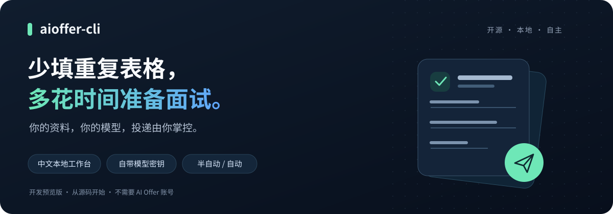

<p align="center">
  
</p>

<h1 align="center">aioffer-cli</h1>

<p align="center"><strong>把重复的网申填写交给助手，把投递决定留给自己。</strong></p>
<p align="center">中文本地工作台 · 自带模型 Key · 企业官网投递 · MIT 开源</p>

<p align="center">
  <a href="https://github.com/Succaiss-applied-ai/aioffer-cli/actions/workflows/check.yml"></a>
  <a href="LICENSE"></a>
  <a href="#快速开始"></a>
  <a href="#当前能用到哪一步"></a>
</p>

<p align="center">
  <a href="#快速开始">快速开始</a> ·
  <a href="docs/providers.md">密钥配置</a> ·
  <a href="docs/usage.md">使用与排障</a> ·
  <a href="#交流与共建">交流与共建</a> ·
  <a href="https://github.com/Succaiss-applied-ai/aioffer-cli/issues">反馈问题</a>
</p>

**aioffer-cli 是一个在你电脑上运行的招聘投递助手。** 用自己的 MinerU 和视觉模型密钥，搜索岗位、整理简历，让 Chrome 插件在企业招聘官网填写资料。不需要 AI Offer 账号，不需要部署数据库，也不需要把密钥交给我们。

> 开发预览版：目前从源码运行，尚未发布 npm 安装包。第一次使用建议选半自动，先处理一个岗位。[了解已验证能力与限制](#当前能用到哪一步)。

## 为什么做这个

求职时，简历已经写过的姓名、教育经历、项目和附件，常常还要在不同官网里重新填一遍。

我们希望把这部分重复操作交给工具：**资料先核对，岗位自己选，是否提交由自己决定。** 它不是承诺拿到 Offer 的“海投神器”，而是一个可以查看代码、使用自己密钥的本地助手。

## 你可以用它做什么

- **先找岗位**：内置 **25,553 条岗位快照**，按岗位、公司、技能搜索，按城市筛选。离线可查；岗位是否仍开放，以官网为准。[快照来源与校验](data/manifest.json)
- **简历只整理一次**：支持 PDF、DOCX、TXT、Markdown；解析后核对结构化资料，保存已确认版本供后续任务使用。当前资料编辑使用 JSON 编辑器。
- **在原招聘网页填写**：通过 Chrome 插件上传附件、填写已有事实，复用 AI Offer 的站点驱动；遇到登录、验证码或资料缺失，需要你接手。
- **自由选择提交方式**：半自动逐岗确认最终提交；自动模式在你授权后处理所选批次。两种模式使用同一执行器。
- **保留本地记录与控制权**：配置、资料版本、任务记录保存在本机；结果不明确时不自动重投。停止任务不能撤回已经提交的申请。

## 快速开始

### 1. 准备环境与密钥

| 准备项 | 用途 |
| --- | --- |
| Node.js 22+、pnpm、Git | 从源码安装并启动本地服务 |
| Chrome | 加载本项目的浏览器插件，操作招聘网页 |
| 一个支持图片输入的模型 API Key | 提取简历资料、理解页面；不是聊天产品的会员账号 |
| MinerU Key | 解析 PDF、DOCX；TXT / Markdown 跳过 MinerU |

密钥申请、API 地址和模型选择见 [中文配置教程](docs/providers.md)。不需要 PostgreSQL、Redis、对象存储账号或 AI Offer 登录。

### 2. 下载并启动

```bash
git clone https://github.com/Succaiss-applied-ai/aioffer-cli.git
cd aioffer-cli
pnpm install --frozen-lockfile
pnpm build
pnpm start
```

没有 pnpm？先在已安装 Node.js 的终端执行 `npm install --global pnpm@12.4.1`，再运行上面的命令。

启动后会打开本地工作台，终端也会显示访问链接。**链接含本机访问凭据，不要分享或公开截图。** 保持终端运行；关闭服务后，网页不能继续创建任务。

### 3. 连接 Chrome 插件

1. 在 Chrome 地址栏打开 `chrome://extensions`，开启右上角的「开发者模式」。
2. 点击「加载已解压的扩展」，选择刚下载项目里的 **`extension/dist`** 文件夹。
3. 在 Chrome 打开终端给出的本地工作台链接，刷新页面，点击「连接本机插件」。
4. 在工作台填写自己的模型与 MinerU 配置，保存后点击「测试视觉模型」。

如果装过旧版 AI Offer 招聘插件，请先停用旧插件，避免页面连接冲突。只能使用本项目构建的本地插件；它需要读取和操作你发起任务的招聘页面，请先阅读权限提示。

### 4. 完成第一次填写

1. **上传简历**：同意将文件交给 MinerU、将资料交给所选模型解析。
2. **核对资料**：纠正提取错误，补充真实信息，点击「核对无误，保存已确认版本」。
3. **选择一个岗位**：核对企业和岗位，先选择「半自动」。
4. **开始填写**：点击「核对本次投递」，确认资料和权限后开始；登录、验证码在原招聘页面处理。
5. **最后自己核对**：检查网页中的内容，再决定是否在本地工作台确认最终投递。想结束就停止任务。

别一开始就选一大批岗位。先确认自己的模型、简历资料和目标网站能配合工作，再决定是否使用自动模式。

## 半自动和自动，怎么选

| | 半自动 · 建议首次使用 | 自动 · 了解风险后使用 |
| --- | --- | --- |
| 每次任务 | 一个岗位 | 所选岗位批次 |
| 填写与上传 | 插件执行 | 插件执行 |
| 最终提交 | 每个岗位由你明确确认 | 创建批次时单独授权最终提交 |
| 页面变化后 | 需要重新核对，旧确认不能复用 | 按执行器的提交保护处理 |
| 登录、验证码、缺少资料 | 需要你处理 | 同样需要你处理，不代表全程无人值守 |

招聘网站协议的勾选权限**单独授权**，不因为选择自动模式就默认同意。只使用真实、经本人核对的资料；不要让模型补造学历、经历或联系方式。

## 用自己的模型，不绑定单一厂商

| 厂商 / 接口 | 当前情况 |
| --- | --- |
| 通义千问 / 百炼 | 已完成 `qwen3-vl-plus` 的真实视觉调用验收 |
| 豆包 / 火山方舟、智谱 GLM | 已实现接口适配，尚未逐家使用真实 Key 验收 |
| OpenAI、Anthropic Claude、Google Gemini | 已实现各自协议适配，尚未逐家使用真实 Key 验收 |
| 自定义 OpenAI-compatible | 可填写兼容地址与视觉模型；必须实际测试，不能保证所有兼容服务可用 |
| MinerU | 已完成合成 PDF 的真实解析与本地导入验收 |

**厂商可选 ≠ 该厂商所有模型都能用。** 必须选择支持图片输入的型号；服务地区、网络、账户额度及调用费用由你与厂商确认。详细步骤见 [模型与 MinerU 配置教程](docs/providers.md)。

## 本地运行，哪些数据仍会外发

“本地”指服务、编排与数据存储在自己的电脑，**不等于完全离线**。

| 去向 | 会接触什么 |
| --- | --- |
| MinerU | 你同意解析的简历文件；TXT / Markdown 不走此服务 |
| 你选择的模型 | 简历文本、待填事实、必要的页面信息和截图 |
| 招聘网站 | 填写到页面的资料、上传的附件，以及你授权提交的申请；上传或填写就可能传输数据，不必等到最终提交 |

- 不连接 AI Offer 云端账号、配额或回调，不添加自动遥测。
- 模型 Key 不交给招聘网页；本地配置中的 Key **明文保存**，不是系统钥匙串。
- 默认数据目录为用户目录下的 `.aioffer-cli`，可通过 `AIOFFER_DATA_DIR` 指定其他目录。
- 服务只监听 `127.0.0.1:19876`。不要通过公网代理暴露本地服务，也不要把访问链接、配置或真实简历发到群里。

安装和更新需要访问 GitHub / npm；MinerU 自身的上传与结果存储链路不需要另购对象存储。完整说明见 [本地配置与隐私](docs/usage.md#本地配置与隐私)。

## 当前能用到哪一步

我们把“代码有实现”“测试通过”“真实网站验收”分开说明：

| 已验证 | 验证范围 |
| --- | --- |
| 模型与简历解析 | 真实通义千问视觉调用、MinerU 合成 PDF 解析、本地资料导入与确认 |
| 真实官网填写 | DeepSeek / Moka：合成附件上传，姓名、邮箱、学历填写，停在最终提交前，停止后没有授予提交许可 |
| 提交与异常保护 | 真实插件配合本机模拟页面，验证两种模式、页面变化后重新确认、模拟登录后重试、停止保护 |
| 自动化回归 | 类型检查、测试、构建、本地边界及 CLI 生命周期检查；最新结果见 [GitHub Actions](https://github.com/Succaiss-applied-ai/aioffer-cli/actions) |

真实官网验收使用经核实后注入私有测试目录的单个岗位，**不是内置岗位库的全量验收，也没有向企业正式投递**。详细范围见 [填写与提交保护验收说明（PR #4）](https://github.com/Succaiss-applied-ai/aioffer-cli/pull/4)。

仍未覆盖所有招聘网站、所有复杂控件、所有模型厂商，以及真实账号登录后的完整恢复路径。内置岗位是静态快照，可能过期；有适配器也不代表对应网站的每个岗位都能自动完成。只有招聘网站的真实回执才能作为成功依据。

## 常见问题

<details>
<summary><strong>有 npm 一键安装包或浏览器商店下载吗？</strong></summary>

当前请使用上面的源码构建与手动加载方式；尚未发布 npm 安装包。不要把同名包、旧云端插件或非本仓库来源的扩展当成本项目。

</details>

<details>
<summary><strong>为什么提示登录？登录后怎么继续？</strong></summary>

先在原招聘标签页完成登录。如果记录显示「登录完成，重新尝试此岗位」，按提示确认，工具会使用原设备、资料和模式创建新尝试，并保留旧记录。不是所有失败都能重试：结果不明确、已获提交许可或已停止的任务不会开放这个入口。不要清空历史来绕过重复保护。

</details>

<details>
<summary><strong>退出后启动失败，需要重装或删除数据吗？</strong></summary>

一般不需要。异常退出后，重新 `pnpm start` 会在确认旧进程不存在时恢复运行锁。若端口被占用或进程仍在运行，先检查原终端；不要强删锁、配置或投递记录。[启动排障](docs/usage.md#启动和退出)

</details>

<details>
<summary><strong>开源免费，是不是模型调用也免费？</strong></summary>

不是。项目代码采用 MIT 许可；模型与 MinerU 的额度、费用由服务商决定。我们不提供共享 Key，也不要求把你的 Key 发给维护者。

</details>

## 交流与共建

正在求职、研究浏览器自动化，或者想让某个招聘官网更好用？欢迎一起把它打磨好。

- **使用问题 / Bug**：[提交 Issue](https://github.com/Succaiss-applied-ai/aioffer-cli/issues/new)，附系统、插件版本、招聘平台和脱敏复现步骤。
- **希望支持的站点 / 功能**：[在 Issues 里讨论](https://github.com/Succaiss-applied-ai/aioffer-cli/issues)，说明遇到了什么表单、预期怎样处理。
- **贡献代码 / 教程**：从 [贡献指南](CONTRIBUTING.md) 开始；补充站点适配、回归测试和中文文档都很有帮助。

**不要在公开 Issue 或社群中发送真实简历、手机号、Cookie、验证码、API Key 或含凭据的本地链接。** 复现问题请使用合成资料，截图先脱敏。

如果这个方向对你有帮助，欢迎点一个 **Star**；想关注后续变化，可以使用 GitHub 的 **Watch**。

## 开发者入口

```bash
pnpm typecheck
pnpm test
pnpm build
pnpm check:cloud
pnpm test:cli
```

`test:cli` 需要本机 `19876` 端口空闲。部分继承的数据库集成测试默认跳过，本地产品运行不依赖数据库。[验证说明与命令](docs/usage.md#开发与验证)

| 目录 | 内容 |
| --- | --- |
| `src/local`、`web` | 本地 CLI、中文工作台、模型适配、资料与岗位库 |
| `src/gateway` | 任务状态、设备配对、租约与回执 |
| `extension/src` | Chrome 执行器与站点驱动 |
| `data` | 岗位快照及校验清单 |
| `docs` | [使用指南](docs/usage.md)、[配置教程](docs/providers.md)、[迁移边界](docs/migration.md) |

维护组织：[Succaiss-applied-ai](https://github.com/Succaiss-applied-ai)。代码采用 [MIT 许可](LICENSE)；岗位内容、第三方商标和依赖保留各自权利。中文文档与教程面向中国用户，许可证保留标准英文正文。
